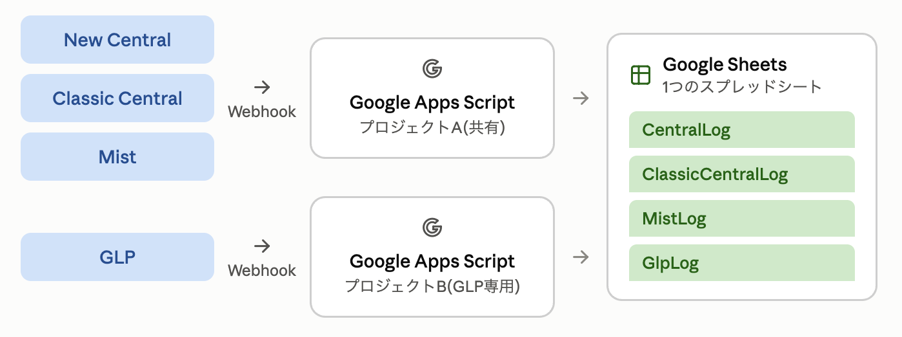

# central-mist-webhook-to-google-sheets

日本語版は [README.ja.md](README.ja.md) をご覧ください。

Receive webhook notifications from **HPE Aruba Networking Central (New)**, **Aruba Central (Classic)**, **HPE Mist** and **HPE GreenLake Platform (GLP)** with Google Apps Script, and log them into a single Google Sheet.

This repository contains the two Apps Script files and the complete, step-by-step setup guide for all four platforms — from the webhook source all the way to rows appearing in the sheet.

## Why Google Apps Script

A local dashboard running in Docker on a laptop cannot receive inbound HTTPS from the internet. Google Apps Script is always on, HTTPS-terminated, globally reachable and free, which makes it a convenient relay: each platform posts to an Apps Script web app, and the script appends rows to a Google Sheet that anything downstream can read.

## Architecture



New Central, Classic Central and Mist share **one Apps Script project** (a container-bound script attached to the spreadsheet) and are routed by the `?source=` query parameter. GLP requires **a separate Apps Script project** (standalone, opening the same spreadsheet via `openById`) — see [section 6](#6-glp-hpe-greenlake-platform) for the reason.

## Repository contents

| Path | Description |
|---|---|
| [`apps-script/central-mist/Code.gs`](apps-script/central-mist/Code.gs) | Container-bound script for New Central / Classic Central / Mist. Routes on `?source=` and writes to `CentralLog` / `ClassicCentralLog` / `MistLog`. |
| [`apps-script/glp/Code.gs`](apps-script/glp/Code.gs) | Standalone script for GLP. Writes to `GlpLog`. Replace `YOUR_SPREADSHEET_ID` before use. |
| `docs/images/` | Architecture diagram |

## Requirements

- A Google account (the spreadsheet and both Apps Script projects live here)
- Administrative access to whichever platforms you want to forward from:
  - New Central: API Gateway and Notification Rules
  - Classic Central: Account Home and Alerts & Events
  - Mist: Organization or Site settings
  - GLP: Manage Workspace → Automations

No servers, no API tokens, no billing.

---

## 1. Prepare the Google Sheet

1. Create one new spreadsheet at [sheets.new](https://sheets.new/). All four sources are consolidated into this single spreadsheet.
2. Note the spreadsheet ID (the string between `/d/` and `/edit` in the URL). The separate GLP project needs it for `openById`.

---

## 2. Shared project setup (New Central / Classic Central / Mist)

### 2-1. Create the Apps Script project

1. From the spreadsheet menu, choose **Extensions → Apps Script**.
2. Delete everything in `Code.gs` and paste in [`apps-script/central-mist/Code.gs`](apps-script/central-mist/Code.gs).
3. Save (Cmd+S / Ctrl+S).
4. From the function dropdown, run `testWithDummyData`, `testClassicCentralWithDummyData` and `testMistWithDummyData` in turn, and confirm that colour-coded test rows appear in the `CentralLog`, `ClassicCentralLog` and `MistLog` sheets.

### 2-2. Deploy as a web app

1. Top right: **Deploy → New deployment**.
2. Select type (gear icon) → **Web app**.
3. **Execute as** → **Me**.
4. **Who has access** → **Anyone**. This is mandatory: none of the platforms hold a Google account.
5. Click **Deploy** and grant the requested permissions.
6. Copy the published **web app URL** (`https://script.google.com/macros/s/XXXXXXXX/exec`).
7. Open that URL directly in a browser and confirm that `{"status":"alive",...}` is returned. (No need for curl. Apps Script web app URLs respond with `302 Moved Temporarily`; a browser follows it automatically, curl fails without `-L`.)

> **When you change the code, use "Manage deployments → edit (pencil) → New version", not "New deployment".** Creating a new deployment changes the URL, which means updating the configuration on every platform again.

---

## 3. New Central

1. Select the **menu icon** in the left panel of Central.
2. Select **Manage** on the **API Gateway** card.
3. Select **Webhooks** in the left navigation, then click **Create Webhooks** in the top right.
4. Configure:
   - **Name**: anything (e.g. `google-sheets-relay`)
   - **Target URL**: the URL from 2-2 with `?source=central` appended

     ```
     https://script.google.com/macros/s/XXXXXXXX/exec?source=central
     ```

   - **Authentication Method**: choose **API Key**. The value does not matter — the receiver (Apps Script) cannot inspect custom headers, and the actual identification is done by the `source` query parameter.
5. Save with **Create**.
6. From the menu icon, select **Manage** on the **Notification Rules** card, then click **Create Rule** in the top right.
7. Set **Select Alerts** (category, device type, alert type) and **Minimum Alert Severity**, choose the webhook above as the delivery target, tick "Enable this notification rule" and click **Finish**.
8. Verify: use the **Test** action in the "…" menu of the webhook on the webhook management screen, and confirm a row is appended to the `CentralLog` sheet.

References: [Getting started with webhooks](https://developer.arubanetworks.com/new-central/docs/getting-started-with-webhooks), [Webhook authentication](https://developer.arubanetworks.com/new-central/docs/webhook-authentication)

---

## 4. Classic Central

Classic Central differs from New Central in **both configuration flow and payload structure**.

| | New Central | Classic Central |
|---|---|---|
| Where webhooks are created | API Gateway → Webhooks | Account Home → Webhooks |
| How alerts are bound | Notification Rules (one rule covers many alerts) | Notification Options, configured **per alert type** under Alerts & Events |
| Payload keys | `id`, `alertId`, `tenantId`, `impactedEntities`, `additionalDetails`, … | `id`, `nid`, `alert_type`, `setting_id`, `device_id`, `details{}`, … |

1. Log in to Classic Central and open **Account Home**.
2. Select **Webhooks** and create a new webhook.
3. Set the **URL** to the Apps Script URL plus `?source=central-classic`:

   ```
   https://script.google.com/macros/s/XXXXXXXX/exec?source=central-classic
   ```

4. Save. (A single webhook can hold up to three URLs for redundancy.)
5. Open the **Alerts & Events** pane in the **Network Operations** app and configure each alert type you want to be notified about. Common ones:
   - [Access Point Alerts](https://developer.arubanetworks.com/central/docs/ap-alerts): AP Disconnected, Rogue AP Detected, Infrastructure Attack Detected, …
   - [Connectivity Alerts](https://developer.arubanetworks.com/central/docs/connectivity-alerts)
   - [Switch Alerts](https://developer.arubanetworks.com/central/docs/switch-alerts)
   - [Gateway Alerts](https://developer.arubanetworks.com/central/docs/gateway-alerts)
6. In each alert's **Notification Options**, select **Webhook** and specify the webhook created in step 3. Start with the important alerts and add more as needed.
7. Verify: trigger or wait for a real alert and confirm a row is appended to the `ClassicCentralLog` sheet.

References: [Webhooks getting started](https://developer.arubanetworks.com/central/docs/webhooks-getting-started), [AP alerts](https://developer.arubanetworks.com/central/docs/ap-alerts), [Webhooks HMAC authentication](https://developer.arubanetworks.com/central/docs/webhooks-hmac-authentication) (HMAC is not implemented here — this is a deliberately simple setup)

Note: `timestamp` is in Unix **seconds**, not milliseconds. Convert with `new Date(timestamp * 1000)`.

---

## 5. Mist

### How the payload differs from the other three

- A single POST may carry **multiple events batched in an `events` array**.
- `org_id` and `site_id` are **inside each event object in the `events` array**, not at the top level of the payload.
- **Key sets differ per topic** (alarms, device-events, minis-application, minis-reachability, …). There is no common schema, so the script picks up the fields that are commonly useful across topics and leaves the rest blank, keeping the full event in a Raw JSON column.

### Steps

1. Log in to the Mist portal and open **Organization → Settings** (for an org-wide webhook) or **Organization → Site Configuration → the site** (for a single site).
2. In the **Webhooks** section, click **Add Webhook**.
3. Configure:
   - **Name**: anything
   - **Webhook Type**: **HTTP Post**
   - **URL**: the Apps Script URL with `?source=mist` appended

     ```
     https://script.google.com/macros/s/XXXXXXXX/exec?source=mist
     ```

   - **Topics**: for troubleshooting purposes, narrowing down is recommended
     - Include: **Alerts** (required), **Audits**, **Device Events**, **Device Up/Downs**
     - Exclude (high volume, will bury the log): Client Join / Client Sessions, Minis Application / Minis Network, NAC Accounting / NAC Events, Mist Edge Events
   - **Secret**: leave unset (authentication is omitted in this simple setup)
   - Leave **Verify Certificate** under Advanced Settings at its default (Yes)
4. Save with **Add**.
5. Verify: the **Webhook Deliveries** screen in the Mist portal shows delivery status, and rows should appear in the `MistLog` sheet. (The count in the Deliveries panel may not match the number of rows in the sheet; this is usually the panel's display-period filter rather than lost data.)

Reference: Setting up Webhooks in Mist (official Mist documentation)

Note: `org_id` / `site_id` live inside the `events` array. Reading them from the top level will almost always yield empty values.

---

## 6. GLP (HPE GreenLake Platform)

### How GLP differs from the other three

- Webhooks can be registered from **either the API or the UI**. UI: **Manage Workspace → Automations → Webhooks**.
- The payload follows the [CloudEvents](https://github.com/cloudevents/spec/blob/v1.0.1/spec.md) standard (`specversion` / `type` / `source` / `id` / `time` / `data`).
- Registration offers an HMAC verification mechanism called "Require challenge request handshake", but **it can be skipped by unticking the box**. Choose "No authentication" as the authentication type and no auth logic is needed on the Apps Script side.
- **The destination URL cannot contain query parameters.** Registration fails with `Invalid URL, Error: destination URL must not contain query parameters`. This is the decisive difference from the other three platforms.
- Using a URL path instead (e.g. `/exec/glp`) was tested and rejected: **appending a path segment after `/exec` on an Apps Script web app URL breaks the "Who has access: Anyone" setting and triggers a login prompt**. It looks fine from a logged-in browser but is blocked for an unauthenticated sender such as GLP.

### Solution: a separate Apps Script project for GLP

Since neither query parameters nor extra paths are usable, create **a separate Apps Script project dedicated to GLP with a bare, undecorated `/exec` URL**. Pointing it at the same spreadsheet ID keeps all logs in one place.

#### 6-1. Create the new project

1. Have the spreadsheet ID from section 1 ready.
2. Create a **new (standalone)** Apps Script project at [script.new](https://script.new/).
3. Paste in [`apps-script/glp/Code.gs`](apps-script/glp/Code.gs) and replace `YOUR_SPREADSHEET_ID` with the ID from step 1.
4. Save, then run `testGlpWithDummyData`. Because this is a different project, **permissions must be granted again** — it will ask for write access to the target spreadsheet. Confirm that test data lands in the `GlpLog` sheet.
5. Deploy → New deployment → Web app → Execute as: Me / Who has access: Anyone → Deploy.
6. Copy the published (bare, undecorated) URL:

   ```
   https://script.google.com/macros/s/YYYYYYYY/exec
   ```

> Because this project is standalone rather than bound to the spreadsheet, its icon in the Google Drive project list looks different from the shared project. That is cosmetic only.

#### 6-2. Register the webhook in the GLP portal

1. Log in to HPE GreenLake and choose **Manage Workspace** from the workspace menu in the header.
2. **Automations → Webhooks → Register webhook**.
3. Fill in the form:
   - **Name**: anything
   - **Webhook URL**: the bare `/exec` URL from 6-1 (no query parameters, no extra path)
   - **Challenge request**: **untick** "Require challenge request handshake"
   - **Shared secret**: leave blank
   - **Authentication type**: **No authentication**
   - **Batching enabled**: leave off (one event per delivery is simpler)
4. Click **Register webhook**.
5. Open the registered webhook and use **Subscribe to event** to select **Service** / **API group** / **Event type** (check the [Event catalog](https://developer.greenlake.hpe.com/docs/greenlake/services#event-catalog)). Up to five event types can be subscribed per webhook.
6. Verify: confirm that real rows are appended to the `GlpLog` sheet. If nothing arrives, check the **Delivery** screen on the GLP side for delivery attempts and their status.

References: [Event service](https://developer.greenlake.hpe.com/docs/greenlake/services/event/public), [Webhooks](https://developer.greenlake.hpe.com/docs/greenlake/services/event/public/webhooks), [UI](https://developer.greenlake.hpe.com/docs/greenlake/services/event/public/ui)

---

## 7. Gotchas and troubleshooting

- **Never define `doPost` twice.** In JavaScript the last definition wins and the first is silently ignored. No error is raised; the earlier code simply becomes dead.
- **Lots of empty log rows**: New Central may be sending payloads with neither `alert.id` nor `alert.alertId`. The guard at the top of `appendAlertToSheet` records the raw JSON in a `Debug` sheet — check there for the cause.
- **Clicking a row in the Apps Script "Executions" panel sometimes does not open the details.** This is an environment-dependent glitch. Writing debug output directly to a sheet (the `Debug` sheet mechanism) is more reliable than `Logger.log` in that case.
- **curl is not a reliable way to verify.** Apps Script web apps respond to POST with `302 Moved Temporarily`, and fetching the redirect target (`script.googleusercontent.com/macros/echo?...`) with curl can fail regardless of cookies. However, **the `doPost` execution itself (the sheet write) completes before the redirect and usually succeeds.** When curl verification is inconclusive, judge by whether rows actually appeared in the sheet.
- **Update deployments via "Manage deployments → edit → New version."** Choosing "New deployment" changes the URL and forces you to update the webhook configuration on every platform.
- **Force IDs to text when numeric interpretation would break them.** Long numeric IDs (such as New Central's `siteId`) are auto-parsed as numbers by Sheets and rounded at the IEEE 754 precision limit (~15–17 digits). Prefixing the value with `'` stores it as text. Rows already saved in rounded form cannot be recovered.
- **Do not append a path after `/exec` on an Apps Script web app URL.** It flips the app into a login-required state and blocks unauthenticated senders. Use a query parameter where allowed, or a separate project.
- **Do not confuse this with each platform's REST API authentication** (token lifetimes and so on). This is webhook configuration only, and is unrelated to the OAuth2 tokens used for Central / Mist API access.

---

## 8. References

- https://github.com/kshimonoj/aruba-webhook-to-gsheet
- https://airheads.hpe.com/discussion/central-webhook-googlenew-central
- https://developer.arubanetworks.com/new-central/docs/getting-started-with-webhooks
- https://developer.arubanetworks.com/new-central/docs/webhook-authentication
- https://developer.arubanetworks.com/central/docs/webhooks-getting-started
- https://developer.arubanetworks.com/central/docs/ap-alerts
- https://developer.arubanetworks.com/central/docs/webhooks-hmac-authentication
- Setting up Webhooks in Mist (official Mist documentation)
- https://developer.greenlake.hpe.com/docs/greenlake/services/event/public
- https://developer.greenlake.hpe.com/docs/greenlake/services/event/public/webhooks
- https://developer.greenlake.hpe.com/docs/greenlake/services/event/public/ui

## Notes

This is a deliberately minimal relay: no HMAC verification, no retry queue, no deduplication. Anyone who learns the `/exec` URL can write arbitrary rows into the sheet, so treat the URL as a secret and do not use this pattern for data you cannot afford to have polluted.

## License

[MIT](LICENSE)
